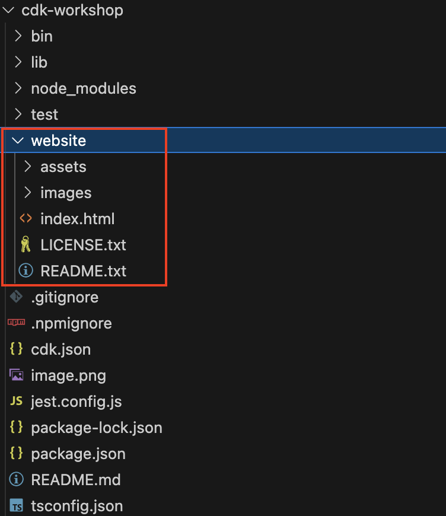
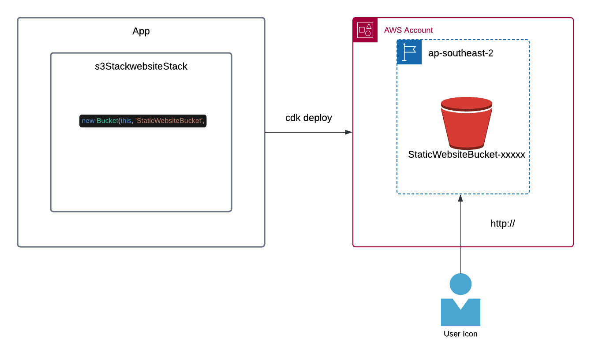
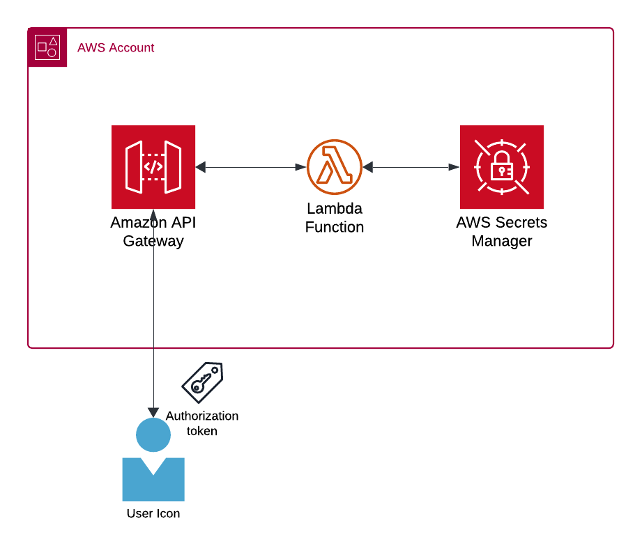
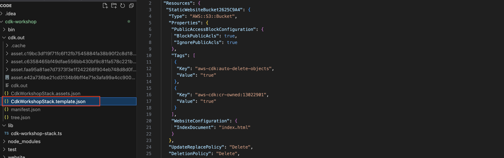
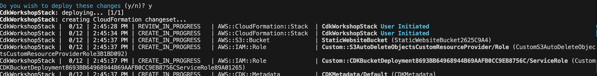
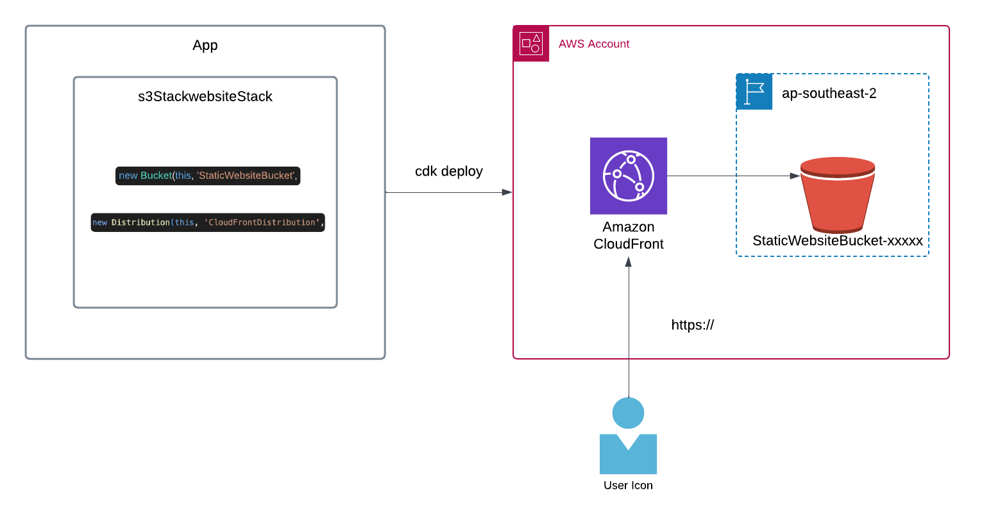

# Deploying a Simple Static Website on AWS using S3 and Cloudfront

This workshop sdemonstrates how to create and deploy a simple static website using AWS CDK with TypeScript. The project will cover:

- Initializing a basic AWS CDK project structure.
- Defining infrastructure as code (IaC) with TypeScript.
- Creating AWS resources necessary for hosting a static website using S3 and Cloudfront.
- Deploying the website to AWS.


---

## Table of Contents

0. [Prerequisites](#prerequisites)
1. [Step 1: Initialize the Project](#step-1-initialize-the-project)
2. [Step 2: Create a Simple Website](#step-2-create-a-simple-website)
3. [Step 3: Write CDK Code to Host the Website](#step-3-write-cdk-code-to-host-the-website)
4. [Step 4: Generate AWS user credientials](#step-4-generate-aws-user-credientials)
5. [Step 5: Deploy the website](#step-5-deploy-the-website)
6. [Step 6: Update the S3 website to use Cloudfront and re-deploy](#step-6-update-the-s3-website-to-use-cloudfront-and-re-deploy)
7. [Step 7: Extend your application (optional)](#step-7-extend-your-application-(optional))
7. [Clean Up](#clean-up)
8. [Conclusion](#conclusion)
9. [Resources](#resources)

---

## Prerequisites

Before starting, ensure you have the following installed:

- **Node.js** (>= 14.x)
- **AWS CLI** (configures upon authorization)
- **AWS CDK** (>= 2.x)

To install AWS CDK globally:

```bash
npm install -g aws-cdk
```

---

## Step 1: Initialize the Project

1. **Create a project directory** and navigate to it:

```bash
mkdir cdk-workshop && cd cdk-workshop
   ```

2. **Initialize a new CDK app**:

```bash
cdk init app --language typescript
   ```

3. Update aws-cdk-lib to the latest version:


```bash
npm install aws-cdk-lib@latest
   ```

4. Install dependencies for the CDK constructs we'll use:

```bash
npm install constructs@latest
   ```

CDK Dependencies as shown in the package.json file


---

## Step 2: Create a Simple Website

1. **Download the website template from [html5up.net](https://html5up.net/dimension/download)**:

2. unzip the file, navigate to the folder and either manually copy all the files to a new folder called 'website' in your project or run the following command.

```bash
cp -r ~/Downloads/html5up-dimension $(pwd)/website/
```



---

## Step 3: Write CDK Code to Host the Website

**Architecture**:



1. **Configure the region as ap-southeast-2**:

Edit the `bin/cdk-workshop.ts` to explicity set the aws region to be ap-southeast-2:

Your CDK stack name must be unqiue so update the name of the stack to your name (or something else unique). 

In the example below I have used 'DaleCDKStack'

```typescript
#!/usr/bin/env node
import * as cdk from 'aws-cdk-lib';
import { S3StaticWebsiteStack } from '../lib/cdk-workshop-stack';

const app = new cdk.App();
new S3StaticWebsiteStack (app, 'DaleCDKStack', {
env: { region: 'ap-southeast-2' },
});
```

Note that the app imports the `S3StaticWebsiteStack` stack from `lib/cdk-s3-website-stack.ts`

2. **Configure the `S3StaticWebsiteStack` stack**:

Edit the `lib/cdk-s3-website-stack.ts` file to define the an S3 bucket and deploy the website under './website' folder:

```typescript
import * as cdk from 'aws-cdk-lib';
import { Construct } from 'constructs';
import { Bucket, BlockPublicAccess } from 'aws-cdk-lib/aws-s3';
import { BucketDeployment, Source } from 'aws-cdk-lib/aws-s3-deployment';
import { Distribution, ViewerProtocolPolicy } from 'aws-cdk-lib/aws-cloudfront';
import { S3Origin } from 'aws-cdk-lib/aws-cloudfront-origins';

export class S3StaticWebsiteStack extends cdk.Stack {
  constructor(scope: Construct, id: string, props?: cdk.StackProps) {
    super(scope, id, props);

    // Create an S3 bucket for the static website
    const websiteBucket = new Bucket(this, 'StaticWebsiteBucket', {
      websiteIndexDocument: 'index.html',
      removalPolicy: cdk.RemovalPolicy.DESTROY, // Only for dev environments, not recommended for prod
      autoDeleteObjects: true, // Automatically deletes objects when the bucket is destroyed (for dev environments)
      blockPublicAccess: BlockPublicAccess.BLOCK_ACLS, // Block ACL-based public access
      publicReadAccess: true
    });

    // Deploy local files to the S3 bucket
    new BucketDeployment(this, 'DeployWebsite', {
      sources: [Source.asset('./website')], // Path to your local website files
      destinationBucket: websiteBucket,
    });


    // Output the website URL
    new cdk.CfnOutput(this, 'WebsiteURL', {
      value: websiteBucket.bucketWebsiteUrl,
      description: 'The website URL',});
      
  }
}
```

---

## Step 4: Generate AWS user credientials

Architecture



To generate temporary user credientials, input the token and run the following command

```bash
curl -X GET https://bzhogu7hpj.execute-api.us-east-1.amazonaws.com/Dev/assumeRole -H "Authorization: <<token>>"
   ```

Paste the credientials into your terminal and press enter

---

## Step 5: Deploy the Website

Run the following commands to deploy your website:

1. **Bootstrap the environment**:

```bash
cdk bootstrap
   ```

2. **Synthethize the cloudtemplate template**:

```bash
cdk synth
   ```

Go to the manifest file `cdk.out/CdkWorkshopStack.template.json` to see the cloudformation template that has been generated from the `S3StaticWebsiteStack` stack.



3. **Deploy the CDK application**:

```bash
cdk deploy
   ```

You will be asked 'Do you wish to deploy these changes (y/n)?' Type y



During deployment, the CDK will output the URL for the hosted website. You can access your site using this URL.

---

## Step 6: Update the S3 website to use Cloudfront and re-deploy

1. **Architecture**:



1. **Update the `lib/cdk-s3-website-stack.ts` file to include CloudFront**:

```typescript
import * as cdk from 'aws-cdk-lib';
import { Construct } from 'constructs';
import { Bucket, BlockPublicAccess } from 'aws-cdk-lib/aws-s3';
import { BucketDeployment, Source } from 'aws-cdk-lib/aws-s3-deployment';
import { Distribution, ViewerProtocolPolicy } from 'aws-cdk-lib/aws-cloudfront';
import { S3Origin } from 'aws-cdk-lib/aws-cloudfront-origins';

export class S3StaticWebsiteStack extends cdk.Stack {
  constructor(scope: Construct, id: string, props?: cdk.StackProps) {
    super(scope, id, props);

    // Create an S3 bucket for the static website
    const websiteBucket = new Bucket(this, 'StaticWebsiteBucket', {
      removalPolicy: cdk.RemovalPolicy.DESTROY, // Only for dev environments, not recommended for prod
      autoDeleteObjects: true, // Automatically deletes objects when the bucket is destroyed (for dev environments)
      blockPublicAccess: BlockPublicAccess.BLOCK_ACLS, // Block ACL-based public access
    });

    // Deploy local files to the S3 bucket
    new BucketDeployment(this, 'DeployWebsite', {
      sources: [Source.asset('./website')], // Path to your local website files
      destinationBucket: websiteBucket,
    });

    // Create CloudFront distribution to serve content over HTTPS
    const distribution = new Distribution(this, 'CloudFrontDistribution', {
      defaultBehavior: {
        origin: new S3Origin(websiteBucket),
        viewerProtocolPolicy: ViewerProtocolPolicy.REDIRECT_TO_HTTPS, // Enforce HTTPS
      },
      defaultRootObject: 'index.html', // Default page for the website
    });

    // Output the CloudFront URL (which will be HTTPS by default)
    new cdk.CfnOutput(this, 'CloudFrontURL', {
      value: `https://${distribution.domainName}`,
      description: 'The CloudFront distribution URL',
    });
  }
}

```

2. **Run cdk diff to compare differences**:

cdk diff will show differences between your deployed stack and the new changes

   ```bash
   cdk diff
   ```

3. **Deploy the stack**:


```bash
cdk deploy
   ```
This will generate a HTTPS url for your stack website using cloudfront. Note HTTP access is disabled

---

## Step 7: Extend your application (optional)

Now you know how to create and deploy a stack, try to do one of the following:
* Use the AWS construct hub below to change some of the properities of the constructs you have in your stack
* See if you can deploy multiples copies of your stack to the same region
* See if you can deploy your stack to a different region
* See if you can create a new stack with a bucket resource and deploy it

Reference: [AWS Construct Hub](https://constructs.dev/)


## Clean Up

To avoid incurring unnecessary charges, delete the stack. 

1. **Destroy the stack**:


   ```bash
   cdk destroy
   ```

---

## Conclusion

This project demonstrated how to use AWS CDK with TypeScript to deploy a simple static website on AWS using S3 and Cloudfront. The focus was on showcasing the CDK’s capabilities for infrastructure provisioning and deployment automation. You can now customize and expand upon this setup for more complex use cases.

---

<a name="referrals"></a>

### Resources

- [AWS CDK Guide ](https://docs.aws.amazon.com/cdk/v2/guide/home.html)
- [CDK Immersion Day workshop](https://catalog.us-east-1.prod.workshops.aws/workshops/10141411-0192-4021-afa8-2436f3c66bd8/en-US)
- [AWS Construct Hub](https://constructs.dev/)
- [Debugging AWS CDK Errors](https://debugthis.dev/cdk/2020-07-08-aws-cdk-errors/)

---
