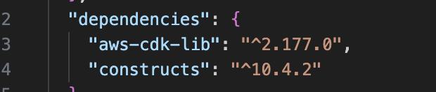

# Deploying a Cloudfront Simple Static Website on AWS with CDK and TypeScript

This workshop sdemonstrates how to create and deploy a simple static website using AWS CDK with TypeScript. The project will cover:

- Initializing a basic AWS CDK project structure.
- Defining infrastructure as code (IaC) with TypeScript.
- Creating AWS resources necessary for hosting a static website.
- Deploying the website to AWS.


---

## Table of Contents

1. [Prerequisites](#prerequisites)
2. [Step 1: Initialize the Project](#step-1-initialize-the-project)
3. [Step 2: Create a Simple Website](#step-2-create-a-simple-website)
4. [Step 3: Write CDK Code to Host the Website](#step-3-write-cdk-code-to-host-the-website)
5. [Step 4: Deploy the Website](#step-4-deploy-the-website)
6. [Full Command History](#full-command-history)
7. [Clean Up](#clean-up)
8. [Conclusion](#conclusion)
9. [Referrals](#referrals)

---

## Prerequisites

Before starting, ensure you have the following installed:

- **Node.js** (>= 14.x)
- **AWS CLI** (https://docs.aws.amazon.com/cli/latest/userguide/getting-started-install.html)
- **AWS CDK** (>= 2.x)

To install AWS CDK globally:

```bash
npm install -g aws-cdk
```

---

## Step 1: Initialize the Project

1. **Create a project directory** and navigate to it:

   ```bash
   mkdir cdk-workshop && cd cdk-workshop
   ```

2. **Initialize a new CDK app**:

   ```bash
   cdk init app --language typescript
   ```

3. Update aws-cdk-lib to the latest version:


   ```bash
   npm install aws-cdk-lib@latest
   ```

4. Install dependencies for the CDK constructs we'll use:

   ```bash
   3. npm install constructs@latest
   ```

CDK Dependencies as shown in the package.json file



---

## Step 2: Create a Simple Website

1. **Download the website template from [html5up.net](https://html5up.net/dimension/download)**:

2. unzip the file, navigate to the folder and manually copy all the files to a new folder called 'website' in your project or run the following command.

```bash
cp -r ~/Downloads/html5up-dimension $(pwd)/website/
```

---

## Step 3: Write CDK Code to Host the Website

Edit the `bin/cdk-workshop.ts` to explicity set the aws region to be ap-southeast-2:

```typescript
#!/usr/bin/env node
import * as cdk from 'aws-cdk-lib';
import { S3StaticWebsiteStack } from '../lib/cdk-workshop-stack';

const app = new cdk.App();
new S3StaticWebsiteStack (app, 'CdkWorkshopStack', {
env: { region: 'ap-southeast-2' },
});
```

Edit the `lib/cdk-s3-website-stack.ts` file to define the an S3 bucket and deploy the website under './website' folder:

```typescript
import * as cdk from 'aws-cdk-lib';
import { Construct } from 'constructs';
import { Bucket, BlockPublicAccess } from 'aws-cdk-lib/aws-s3';
import { BucketDeployment, Source } from 'aws-cdk-lib/aws-s3-deployment';
import { Distribution, ViewerProtocolPolicy } from 'aws-cdk-lib/aws-cloudfront';
import { S3Origin } from 'aws-cdk-lib/aws-cloudfront-origins';

export class S3StaticWebsiteStack extends cdk.Stack {
  constructor(scope: Construct, id: string, props?: cdk.StackProps) {
    super(scope, id, props);

    // Create an S3 bucket for the static website
    const websiteBucket = new Bucket(this, 'StaticWebsiteBucket', {
      websiteIndexDocument: 'index.html',
      removalPolicy: cdk.RemovalPolicy.DESTROY, // Only for dev environments, not recommended for prod
      autoDeleteObjects: true, // Automatically deletes objects when the bucket is destroyed (for dev environments)
      blockPublicAccess: BlockPublicAccess.BLOCK_ACLS, // Block ACL-based public access
      publicReadAccess: true
    });

    // Deploy local files to the S3 bucket
    new BucketDeployment(this, 'DeployWebsite', {
      sources: [Source.asset('./website')], // Path to your local website files
      destinationBucket: websiteBucket,
    });


    // Output the website URL
    new cdk.CfnOutput(this, 'WebsiteURL', {
      value: websiteBucket.bucketWebsiteUrl,
      description: 'The website URL',});
      
  }
}
```

---

## Step 5: Run the following curl command to generate AWS user credientials


---

## Step 6: Deploy the Website

Run the following commands to deploy your website:

1. **Bootstrap the environment**:

   ```bash
   cdk bootstrap
   ```


2. **Synthethize the cloudtemplate template**:

   ```bash
   cdk synth
   ```


During deployment, the CDK will output the URL for the hosted website. You can access your site using this URL.

---

## Full Command History


---

## Clean Up

To avoid incurring unnecessary charges, delete the stack. If the `cdk destroy` command fails due to non-empty buckets, empty the bucket manually or use the `autoDeleteObjects` property in your stack as shown above:

1. **Manually empty the bucket**:

   ```bash
   aws s3 rm s3://<bucket-name> --recursive
   ```

2. **Destroy the stack**:

   ```bash
   cdk destroy
   ```

---

## Conclusion

This project demonstrated how to use AWS CDK with TypeScript to deploy a simple static website on AWS. The focus was on showcasing the CDK’s capabilities for infrastructure provisioning and deployment automation. You can now customize and expand upon this setup for more complex use cases.

---

<a name="referrals"></a>

### Referrals

- [AWS CDK Create Project](https://cdkworkshop.com/20-typescript/20-create-project/500-deploy.html)
- [How to Add S3 BucketPolicy with AWS CDK](https://stackoverflow.com/questions/60310575/how-to-add-s3-bucketpolicy-with-aws-cdk)
- [How to Force Delete a Non-Empty S3 Bucket with Versioning Enabled](https://stackoverflow.com/questions/62694166/how-to-force-delete-a-non-empty-s3-bucket-with-versioning-enabled)
- [Debugging AWS CDK Errors](https://debugthis.dev/cdk/2020-07-08-aws-cdk-errors/)
- Cover Image by [@glenncarstenspeters](https://unsplash.com/@glenncarstenspeters) from [Unsplash](https://unsplash.com/photos/person-using-macbook-pro-npxXWgQ33ZQ)

---